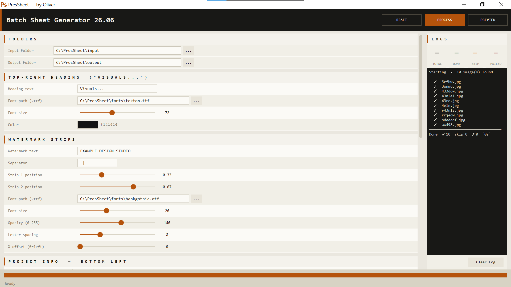
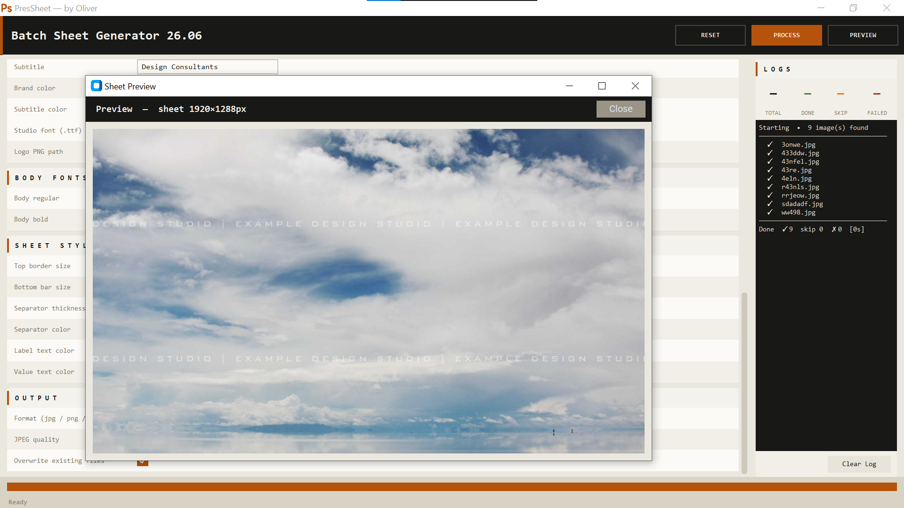

# PresSheet

### Batch Presentation Sheet Generator for Architectural Visualization

Turn hundreds of raw renders into clean, studio-ready presentation sheets in minutes.

PresSheet is a desktop application built with Python for architects, visualization artists, students, and design studios who need to generate consistent presentation sheets without manually editing every image.

Instead of spending hours arranging renders, adding titles, logos, watermarks, borders, and maintaining a consistent visual language, PresSheet automates the entire workflow while giving you complete control over the final appearance.

---

# Why PresSheet?

Creating presentation sheets is one of the most repetitive parts of architectural visualization.

Whether you're preparing:

- Client presentations
- Portfolio projects
- Competition submissions
- University juries
- Marketing material
- Internal design reviews

...the process is usually the same:

- Open image
- Add title
- Add logo
- Add border
- Add watermark
- Export
- Repeat hundreds of times

PresSheet eliminates that repetitive work with a single batch process.

---

# Screenshots

## Main Workspace



The application provides a simple desktop interface where you configure every element of the sheet before processing.

---

## Generated Presentation Sheet



Every output follows the same layout and branding, producing professional and consistent presentation sheets across the entire project.

---

# Features

## Batch Processing

Generate presentation sheets for an entire folder of renders with a single click.

No manual editing.

No repetitive exporting.

---

## Complete Layout Customization

Customize nearly every visual aspect of the sheet, including:

- Heading placement
- Text alignment
- Margins
- Spacing
- Border thickness
- Divider lines
- Layout proportions

---

## Typography Control

Adjust:

- Font size
- Font color
- Position
- Header appearance

to match your firm's presentation style.

---

## Studio Branding

Keep every presentation consistent by adding:

- Company logo
- Project title
- Custom branding elements

---

## Watermark Strip Generation

Automatically generate professional watermark strips without editing each render manually.

---

## Live Preview

Preview your presentation sheet before generating the final batch.

Make adjustments instantly until the layout looks exactly how you want.

---

## Appearance Controls

Fine-tune visual details including:

- Background colors
- Separator colors
- Borders
- Margins
- Padding
- Image spacing
- Text positioning

---

## Multiple Output Formats

Export generated sheets as:

- PNG
- JPEG

---

# Built With

- Python
- CustomTkinter
- Pillow (PIL)

---

# Installation

Clone the repository

```bash
git clone https://github.com/ofelixfx/PresSheet.git
```

Move into the project

```bash
cd PresSheet
```

Install dependencies

```bash
pip install customtkinter pillow
```

Run the application

```bash
python main.py
```

---

# How It Works

1. Select the folder containing your renders.
2. Choose an output directory.
3. Configure your sheet layout.
4. Customize branding, typography, borders, and colors.
5. Preview the result.
6. Click **Process**.
7. Let PresSheet generate presentation sheets for every render automatically.

---

# Included Documentation

A detailed user guide is included with the project.

**User_Guide.pdf**

The guide covers:

- Installation
- Interface overview
- Every available setting
- Workflow examples
- Tips for best results

---

# Ideal For

PresSheet is designed for:

- Architectural Visualization Artists
- Architects
- Interior Designers
- Landscape Designers
- Architecture Students
- Freelance Visualization Artists
- Design Studios

---

# Contributing

Contributions, suggestions, and feature requests are always welcome.

If you discover a bug or have an idea that could improve PresSheet, feel free to open an issue or submit a pull request.

---

# License

This project is licensed under the **MIT License**.

---

# Author

**Oliver Felix**

---

## If you found PresSheet useful

Consider giving the repository a ⭐ on GitHub.

It helps others discover the project and supports future development.
